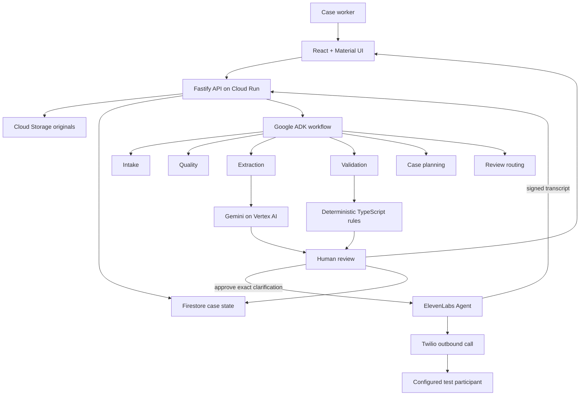

# ClaimFlow AI

> Evidence-first agentic AI for turning messy business documents into structured, validated, human-reviewable cases.

**Live application:** https://claimflow-api-vb6ijwpumq-ts.a.run.app  
**Repository:** https://github.com/amin076/claimflow-agent

ClaimFlow AI is a production-oriented prototype for claims, restoration, field-service and other document-heavy workflows. It converts mixed-quality PDFs, photographs, forms, notes and email-style inputs into a structured case while preserving source evidence, uncertainty, deterministic business rules and human control.

The initial working prototype was built over approximately **three days of focused development**, then hardened with automated tests, production deployment checks, failure handling, audit trails and a controlled human-review workflow.

ClaimFlow is a **case-preparation and reconciliation system**. It does not autonomously approve or deny insurance claims.

## What the system does

ClaimFlow can:

- create and persist cases;
- upload PDF/JPEG/PNG source evidence;
- store original documents in Cloud Storage and case state in Firestore;
- process bounded multi-page packets with Gemini on Vertex AI;
- run a controlled six-stage Google ADK workflow;
- validate model output with Zod;
- materialize typed fields with confidence and page-linked evidence;
- apply deterministic TypeScript validation rules;
- detect missing fields, low confidence, invalid values and contradictions;
- route uncertainty to a human reviewer;
- preserve review decisions and agent activity in an audit trail;
- optionally prepare a human-approved clarification question;
- verify signed clarification transcripts before attaching them as evidence;
- keep conflicted values unresolved until a human saves the canonical correction;
- recover safely from stale or interrupted processing;
- fail closed on invalid model output, timeouts, page-budget violations and unreadable input.

## Architecture



The architectural boundary is deliberate:

> **AI interprets and proposes; schemas, deterministic rules, persistence, authorization gates and consequential state transitions remain ordinary code.**

Detailed documentation:

- [System architecture](docs/architecture.md)
- [Agent architecture](docs/agent-architecture.md)
- [Human review policy](docs/human-review-policy.md)
- [Engineering quality and auditing](docs/engineering-quality.md)
- [Cloud deployment](docs/cloud-deployment.md)

## Six-stage agent workflow

```text
INTAKE -> QUALITY -> EXTRACTION -> VALIDATION -> CASE_PLANNER -> REVIEW_ROUTER
```

Each persisted `AgentRun` can record status, timestamps, model/model version, prompt version, token usage, duration, input/output references and a safe error summary.

Voice clarification is a separate human-approved workflow layered on top of review. It never bypasses deterministic validation or the human correction boundary.

## Technology

| Layer | Technology |
| --- | --- |
| Frontend | React, TypeScript, Vite, Material UI |
| API | Node.js, TypeScript, Fastify |
| Agent orchestration | Google Agent Development Kit (ADK) |
| Multimodal extraction | Gemini on Vertex AI |
| Voice clarification | ElevenLabs Agents + Twilio |
| Runtime contracts | Zod |
| Deterministic validation | TypeScript rules |
| Case data | Firestore |
| Original documents | Cloud Storage |
| Secrets | Google Secret Manager |
| Runtime | Google Cloud Run |
| CI/CD | GitHub Actions + Google OIDC/WIF |
| Testing | Vitest + Firestore emulator + container smoke tests |

## Reliability and failure handling

ClaimFlow treats model output as untrusted until it passes both schema and business-rule validation.

Key controls include:

- structured output validation with Zod;
- page-linked source evidence for extracted fields;
- deterministic rules for dates, required fields, confidence and contradictions;
- human review for uncertainty and conflicting sources;
- bounded model invocations and explicit timeout handling;
- no silent conflict resolution;
- no automatic transcript-to-field mutation;
- HMAC verification for inbound clarification webhooks;
- idempotency protection against webhook replay and duplicate calls;
- stale-execution recovery without silently re-billing the model;
- fail-closed behaviour for malformed, truncated or unsupported model output.

## How I locate problems and audit failures

The system is deliberately instrumented so failures can be narrowed to a specific layer instead of being treated as "the AI failed".

```text
UI / API request
  -> storage / persistence
  -> ADK workflow stage
  -> model provider call
  -> schema validation
  -> deterministic business rules
  -> human-review transition
  -> external clarification provider
  -> webhook / persistence
```

For each incident I check the smallest failing boundary first: HTTP status and request ID, persisted `AgentRun`, provider error category, raw-vs-validated model result, rule failures, audit events and final state transition. Reproduction is then captured as a unit/integration regression test before the fix is considered complete.

See [Engineering quality and auditing](docs/engineering-quality.md) for the test pyramid and debugging workflow.

## Automated quality gates

Local quality checks:

```bash
npm run format:check
npm run lint
npm run typecheck
npm test
npm run build
```

CI repeats those checks and also runs:

- Firestore emulator integration tests;
- packaged-container smoke tests;
- deployment through GitHub OIDC / Workload Identity Federation;
- post-deploy `/health`, `/ready` and web-root checks;
- release invariants for protected voice configuration.

The test suite covers success paths and failure cases including invalid model JSON, schema violations, foreign evidence references, token/safety stops, concurrency protection, provider timeout/abort, stale recovery, unreadable files, date validation, contradictions, reviewer authorization, webhook signatures, replay idempotency and human-only canonical correction.

## Local development

Requirements:

- Node.js 22+
- npm 11+
- Git

```bash
git clone https://github.com/amin076/claimflow-agent.git
cd claimflow-agent
npm ci
cp .env.example .env
npm run dev
```

Local development defaults to cloud-independent adapters:

```env
STORAGE_MODE=local
DATABASE_MODE=memory
AI_MODE=mock
```

Frontend: `http://localhost:5173`  
Backend: `http://localhost:8080`  
Health: `http://localhost:8080/health`

## Repository map

```text
claimflow-agent/
├── apps/
│   ├── api/
│   └── web/
├── packages/
│   ├── config/
│   └── domain/
├── docs/
├── sample-data/
├── scripts/
├── .github/workflows/
└── README.md
```

## Contributors

- **Amin Nazari** - product direction, agent architecture, backend, Google Cloud integration and evaluation
- **Behzad** - frontend/human-review experience and demo support

## Responsible-use boundary

This public prototype uses synthetic/redacted test data. It is not an insurance decision engine and must not autonomously approve/deny claims, determine legal liability, declare structural safety or process unredacted production data without appropriate enterprise controls.

## License

Apache License 2.0. See [LICENSE](LICENSE).
