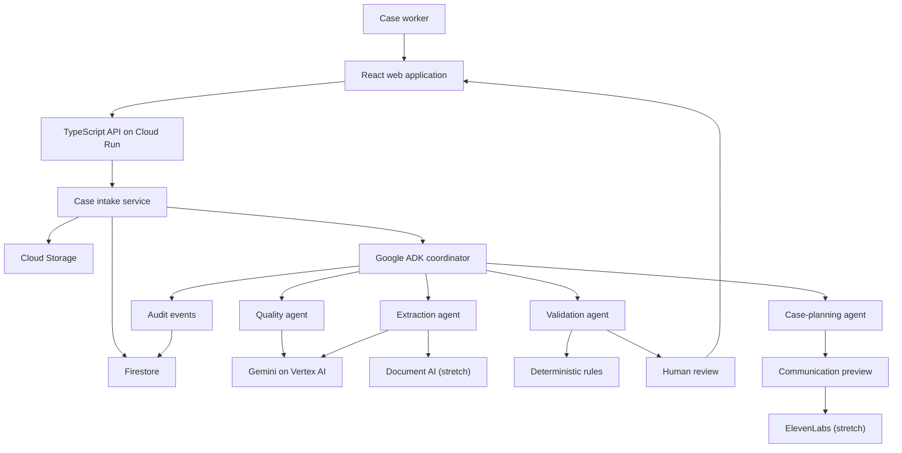

# ClaimFlow AI

> Evidence-first agentic AI for turning messy business documents into structured, validated, actionable cases.

[](#project-status)
[](#hackathon-scope)
[](LICENSE)

## Overview

ClaimFlow AI is an agentic document-intelligence application for restoration, claims, field-service, and other document-heavy operations. It is designed to process mixed-quality inputs—emails, photographs, PDFs, invoices, reports, and handwritten forms—while preserving evidence, uncertainty, and human control.

The system does more than transcribe text. It creates a traceable case record, compares facts across documents, identifies missing or conflicting information, and recommends the next operational action. Low-confidence or consequential decisions are routed to a human reviewer.

## Problem

Business teams often receive critical information through fragmented and inconsistent channels:

- blurred or rotated mobile photographs;
- unclear handwriting;
- incomplete forms;
- long email threads;
- invoices and reports using different identifiers;
- duplicate or contradictory facts;
- missing signatures, dates, addresses, or contact details.

Manual processing is slow and error-prone. A basic OCR pipeline can extract text, but it cannot reliably explain where a value came from, reconcile conflicting evidence, or decide when a human must intervene.

## Proposed solution

ClaimFlow AI will provide an end-to-end workflow:

1. Ingest multiple documents and an email narrative.
2. Assess image and document quality.
3. Classify each document.
4. Extract structured fields with confidence and source evidence.
5. validate deterministic business rules.
6. Compare facts across documents and identify contradictions.
7. Route uncertainty to a human review queue.
8. Produce a case summary and recommended next actions.
9. Prepare—not automatically send—customer communications.
10. Record an auditable timeline of agent, rule, and human decisions.

## Architecture



See [System Architecture](docs/architecture.md) and [Agent Architecture](docs/agent-architecture.md).

## Core design principles

- **Evidence first:** every extracted field links back to its source document and supporting evidence.
- **Uncertainty is explicit:** confidence is stored and visible; the system does not silently invent missing facts.
- **Human control:** high-impact, conflicting, or low-confidence outcomes require review.
- **Deterministic guardrails:** dates, identifiers, amounts, required fields, and state transitions are checked in code.
- **Auditable execution:** model output, rule results, human corrections, and case transitions are recorded.
- **Minimum necessary data:** the prototype uses synthetic/redacted data and avoids unnecessary personal information.
- **Agentic where useful:** agents interpret and plan; ordinary services handle storage, validation, and authorization.

## Planned agents

| Agent               | Responsibility                                          | Must not do                       |
| ------------------- | ------------------------------------------------------- | --------------------------------- |
| Intake coordinator  | Create the case and select the workflow                 | Make claim decisions              |
| Quality agent       | Detect blur, cropping, rotation, and unreadable regions | Guess obscured content            |
| Extraction agent    | Produce typed fields with confidence and evidence       | Hide ambiguity                    |
| Validation agent    | Reconcile documents and identify conflicts              | Override deterministic rules      |
| Case-planning agent | Summarise the case and recommend actions                | Execute consequential actions     |
| Communication agent | Draft a message or voice interaction                    | Contact a person without approval |

## Planned technology

| Layer                | Technology                              |
| -------------------- | --------------------------------------- |
| Web application      | React, TypeScript, Vite, Material UI    |
| API                  | Node.js, TypeScript, Fastify            |
| Agent orchestration  | Google Agent Development Kit (ADK)      |
| Multimodal reasoning | Gemini on Vertex AI                     |
| Specialist OCR/forms | Google Document AI (stretch goal)       |
| Runtime validation   | Zod plus deterministic TypeScript rules |
| Case data            | Firestore                               |
| Original documents   | Cloud Storage                           |
| Deployment           | Google Cloud Run                        |
| Voice experience     | ElevenLabs (stretch goal)               |
| Testing              | Vitest                                  |
| Delivery             | GitHub Actions                          |

Technology choices are evaluated continuously against delivery time, cost, latency, and demo reliability.

## Planned user experience

1. **New Case** — upload synthetic sample documents and paste an email narrative.
2. **Processing Timeline** — see which agent or rule is running.
3. **Case Workspace** — compare source documents with extracted fields.
4. **Review Queue** — accept, edit, or reject uncertain values.
5. **Case Summary** — see conflicts, risks, and recommended next actions.
6. **Communication Preview** — review a proposed email or voice interaction before any external action.

## Hackathon scope

This project is intended for the **Forward: AI in Business Hackathon**:

- Main submission: **Track 1 — Improve an Existing Business Capability**
- Optional parallel submission: **Built With ElevenLabs**
- Target: a deployed, end-to-end MVP demonstrable in 3–5 minutes
- Team size: 2–5 participants

### Project status

**Active hackathon build.** Phases 1 and 2 provide the TypeScript workspace, React
interface, Fastify API, evidence-linked domain model, synthetic fixtures, tests,
and CI. Cloud persistence and deployment are the next milestones.

## MVP acceptance criteria

The MVP is complete when a reviewer can:

- upload a small synthetic multi-document case;
- receive classified documents and typed extracted fields;
- inspect confidence and source evidence;
- see at least one detected missing field or contradiction;
- correct an uncertain value in the review queue;
- generate a traceable case summary and next-action recommendation;
- complete the flow through a stable deployed URL.

See the [Roadmap](docs/roadmap.md) and [Demo Scenario](docs/demo-scenario.md).

## Local development

The local application does **not** require a Google Cloud account, `gcloud`,
Firestore, or Gemini credentials. It uses local storage, an in-memory database,
and mock AI settings by default.

### Required versions

| Tool       |   Team version | Notes                                                    |
| ---------- | -------------: | -------------------------------------------------------- |
| Git        | Current stable | Required to clone, pull, branch, and commit              |
| Node.js    |  22.x or newer | CI uses Node.js 22; use Node.js 22 for identical results |
| npm        |         11.9.0 | Pinned by `packageManager`; do not use Yarn              |
| TypeScript |          6.0.3 | Installed locally by npm; do not install it globally     |

Check your versions in PowerShell:

```powershell
git --version
node --version
npm --version
```

If npm is not `11.9.0`:

```powershell
npm install --global npm@11.9.0
```

Close and reopen PowerShell after installing or updating Node.js/npm so the
updated programs are available on `PATH`.

### First-time setup on Windows

```powershell
git clone https://github.com/amin076/claimflow-agent.git
Set-Location claimflow-agent
git switch main
git pull origin main
npm ci
Copy-Item .env.example .env
npm run dev
```

`npm run dev` starts both applications:

- Frontend: <http://localhost:5173>
- Backend: <http://localhost:8080>
- Health endpoint: <http://localhost:8080/health>
- Synthetic case endpoint: <http://localhost:8080/api/cases/demo>

Open <http://localhost:5173> and select **Create demo case**. The page should
display case `CF-2026-001`, extracted fields, confidence, evidence, and two
open issues.

### Run Frontend and Backend separately

This is useful when diagnosing errors or working on only one application.

Terminal 1:

```powershell
npm run dev:api
```

Terminal 2:

```powershell
npm run dev:web
```

Confirm the Backend from another PowerShell window:

```powershell
Invoke-RestMethod http://localhost:8080/health
Invoke-RestMethod http://localhost:8080/api/cases/demo
```

### Start work each day

```powershell
git switch main
git pull origin main
npm ci
git switch -c feature/short-description
npm run dev
```

Do not work directly on `main`. If your branch already exists, replace the
`git switch -c` command with `git switch your-branch-name`.

### Quality checks before a Pull Request

```powershell
npm run format:check
npm run lint
npm run typecheck
npm test
npm run build
```

All checks must pass before merging. GitHub Actions repeats the same checks.

For complete setup, daily workflow, troubleshooting, and Google Cloud
boundaries, see the [Local Development Guide](docs/local-development.md) or its
[Farsi version](docs/local-development.fa.md).

## Repository map

```text
.
├── apps/
│   ├── api/
│   └── web/
├── packages/
│   ├── config/
│   └── domain/
├── README.md
├── CONTRIBUTING.md
├── LICENSE
├── docs/
│   ├── architecture.md
│   ├── agent-architecture.md
│   ├── data-model.md
│   ├── demo-scenario.md
│   ├── human-review-policy.md
│   ├── judging-strategy.md
│   ├── local-development.md
│   ├── local-development.fa.md
│   ├── problem-statement.md
│   ├── product-vision.md
│   ├── roadmap.md
│   ├── roadmap.fa.md
│   ├── security-and-privacy.md
│   └── team-responsibilities.md
├── sample-data/
│   └── README.md
└── .github/
    ├── workflows/ci.yml
    ├── pull_request_template.md
    └── ISSUE_TEMPLATE/
        ├── bug.md
        └── feature.md
```

## Team

- **Amin Nazari** — product direction, agent architecture, backend, Google Cloud, integration
- **Behzad** — proposed ownership: frontend, human-review experience, sample case, demo and pitch support

Final responsibilities are documented in [Team Responsibilities](docs/team-responsibilities.md).

## Responsible-use boundary

ClaimFlow AI is a hackathon prototype, not an insurance decision engine. It must not autonomously approve or deny claims, determine legal liability, contact real customers, or process unredacted production data. All sample inputs should be synthetic or properly redacted.

The project is not affiliated with, endorsed by, or connected to any restoration company, insurer, or claims-management provider unless explicitly stated later.

## Contributing

Use focused branches and pull requests. Do not push product implementation directly to `main`. See [CONTRIBUTING.md](CONTRIBUTING.md).

## License

Licensed under the [Apache License 2.0](LICENSE).
