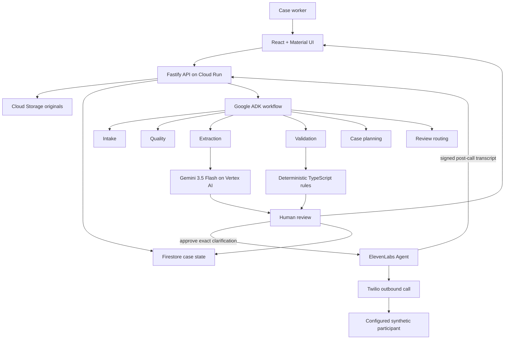

# ClaimFlow AI

> Evidence-first agentic AI for turning messy business documents into structured, validated, human-reviewable cases — with human-approved voice clarification when the documents disagree.

[](#project-status)
[](#hackathon-scope)
[](LICENSE)

**Live application:** https://claimflow-api-vb6ijwpumq-ts.a.run.app

## Overview

ClaimFlow AI is an agentic document-intelligence workflow for claims, restoration, field-service, and other document-heavy operations. It turns mixed-quality PDFs, photos, forms, notes, and email-style inputs into a structured case while preserving source evidence, uncertainty, deterministic business rules, and human control.

The system does more than transcribe text. It links extracted facts to source pages, detects missing or conflicting information, routes uncertainty to a reviewer, and records both agent activity and human decisions in an audit trail. When a contradiction cannot be resolved from the supplied documents, a protected reviewer can approve an exact clarification question and explicitly start an ElevenLabs/Twilio call to a configured synthetic test participant. The signed transcript returns as evidence, but the case is not changed until a human saves the canonical correction.

ClaimFlow is a hackathon prototype for **case preparation**. It does **not** autonomously approve or deny insurance claims.

## Why this matters

Business teams often receive important information through fragmented and inconsistent documents:

- mobile photographs and scans;
- handwritten or partially readable forms;
- incomplete forms;
- long notes and email threads;
- invoices and reports with different values;
- duplicate or contradictory facts;
- missing dates, identifiers, addresses, or contact details.

A plain OCR pipeline can copy text, but staff still have to determine where a value came from, whether two sources disagree, and when a person must intervene. ClaimFlow focuses on that reconciliation layer.

## Verified MVP behavior

The deployed MVP has been live-verified to:

- create and persist a synthetic case;
- upload PDF/JPEG/PNG source documents;
- store originals in Cloud Storage and case state in Firestore;
- process a bounded multi-page packet with Gemini 3.5 Flash on Vertex AI;
- run a controlled six-stage Google ADK workflow;
- validate model output with Zod;
- materialize typed fields with confidence and page-linked evidence;
- apply deterministic TypeScript business rules;
- detect missing fields, low confidence, invalid values, and contradictions;
- require human correction for conflicting source values;
- draft clarification wording with Gemini when available and safely fall back to a deterministic template when it is not;
- require a protected human approval before any ElevenLabs call;
- initiate a real ElevenLabs/Twilio outbound clarification call only to the server-configured consenting test participant;
- verify a signed post-call transcript webhook and attach the transcript as clarification evidence;
- keep the conflicted field unchanged until the human reviewer saves one canonical correction with a reason;
- preserve review decisions and audit events;
- recover stale processing safely without silently re-billing the model;
- fail closed on invalid model output, timeouts, page-budget violations, and unreadable input;
- deploy automatically from `main` to Cloud Run through GitHub Actions using OIDC / Workload Identity Federation.

## Live conflict + voice clarification example

The official five-page synthetic motor-claim packet contains two deliberate conflicts:

- `incident.date`: `2026-09-10` versus `2026-09-11`;
- `damage.estimatedAmount`: `AUD 4,860.00` versus `AUD 4,142.00`.

For `incident.date`, the production acceptance run demonstrated the full loop:

1. ClaimFlow preserved both source values and created a `CONTRADICTION` issue.
2. The reviewer requested clarification.
3. Optional Gemini wording was unavailable in that run, so the safe deterministic question remained available instead of failing the workflow.
4. The reviewer inspected and approved the exact question.
5. ElevenLabs/Twilio called the configured synthetic participant.
6. The participant confirmed `2026-09-11`.
7. The ElevenLabs agent repeated the answer for confirmation and ended the call.
8. A signed transcript returned to ClaimFlow as evidence.
9. The field was still unresolved until the reviewer manually entered `2026-09-11` and supplied a reason.
10. Deterministic validation reran and the clarification became `RESOLVED`.

That behavior is intentional: neither Gemini nor ElevenLabs is allowed to silently choose the authoritative value.

See [ElevenLabs live acceptance](docs/elevenlabs-live-acceptance.md).

## Architecture



The important architectural boundary is that **agents interpret and communicate, while schemas, deterministic rules, persistence, authorization gates, and consequential state transitions remain ordinary code**.

See:

- [System architecture](docs/architecture.md)
- [Agent architecture](docs/agent-architecture.md)
- [Human review policy](docs/human-review-policy.md)
- [ElevenLabs clarification design](docs/elevenlabs-clarification.md)

## Six-stage workflow

```text
INTAKE → QUALITY → EXTRACTION → VALIDATION → CASE_PLANNER → REVIEW_ROUTER
```

Each persisted `AgentRun` can record status, timestamps, model/model version, prompt version, token usage, duration, input/output references, and a safe error summary.

Voice clarification is a separate human-approved workflow layered on top of the review stage; it never bypasses the deterministic validation or human correction boundary.

## Safety model

ClaimFlow uses several independent controls:

- **Synthetic/redacted data only** for the prototype.
- **Structured output validation** with Zod.
- **Source evidence** attached to extracted fields.
- **Deterministic rules** for dates, required fields, contradictions, confidence, and state transitions.
- **Human review** for uncertainty and conflict.
- **No automatic claim decision.**
- **No automatic external contact.** Voice clarification requires the reviewer key, an editable draft, explicit approval, and a separate explicit call action.
- **Fixed voice destination.** The browser cannot supply an arbitrary phone number; calls are restricted to a server-configured consenting test participant.
- **Signed webhook verification.** Post-call transcript events are HMAC verified and mapped through the persisted provider conversation ID.
- **No automatic transcript-to-field mutation.** A transcript is supporting evidence only; a human must save the canonical value and reason.
- **No automatic call retry** after an ambiguous provider timeout.
- **No silent conflict resolution.**
- **Fail-closed behavior** for invalid/truncated model output.
- **Single bounded model invocation** per processing attempt; no hidden retry loop.

## Technology

| Layer | Technology |
| --- | --- |
| Frontend | React, TypeScript, Vite, Material UI |
| API | Node.js, TypeScript, Fastify |
| Agent orchestration | Google Agent Development Kit (ADK) |
| Multimodal extraction | Gemini 3.5 Flash on Vertex AI |
| Voice clarification | ElevenLabs Agents + Twilio |
| Runtime contracts | Zod |
| Deterministic validation | TypeScript rules |
| Case data | Firestore |
| Original documents | Cloud Storage |
| Secrets | Google Secret Manager |
| Runtime | Google Cloud Run |
| CI/CD | GitHub Actions + Google OIDC/WIF |
| Testing | Vitest + Firestore emulator + container smoke tests |

### Document AI decision

Google Document AI was evaluated as an optional specialist OCR/forms layer. It is **deferred for the hackathon MVP** because the live five-page synthetic benchmark was successfully processed by Gemini multimodal extraction with page-linked evidence and the deliberate conflicts preserved.

Document AI becomes worthwhile if later handwriting, blurry-scan, dense-table, or layout benchmarks demonstrate a measurable improvement that justifies the extra service complexity.

See [Phase 9 evaluation](docs/phase9-document-ai-evaluation.md).

## Project status

**Submission-ready hackathon MVP, live verified in production.**

| Phase | Status |
| --- | --- |
| 0–5 — scope, foundations, domain, local flow, Google Cloud persistence | ✅ Complete |
| 6 — Gemini multimodal extraction | ✅ Live verified |
| 7 — ADK agent workflow | ✅ Live verified |
| 8 — deterministic rules and human review | ✅ Live verified and conflict-hardened |
| 9 — Document AI evaluation | ✅ Complete; deferred by evidence |
| 10 — CI/CD and secure deployment | ✅ Complete; keyless auto-deploy verified |
| 11 — observability and evaluation | ✅ Complete for hackathon MVP |
| ElevenLabs voice clarification | ✅ Production E2E live verified |
| 12 — demo and submission | 🟢 Submission package ready; final recording/form submission remain |

### Latest verified release evidence

Voice integration baseline before final submission cleanup:

- merge commit `adf9664a0b3b11c9948cb6ffa3236ec1c83598a9`;
- GitHub Actions CI run `#66` passed quality, Firestore integration, container smoke, OIDC authentication, Cloud Run deployment, stable URL health/readiness, and voice secret-reference preservation;
- Cloud Run revision `claimflow-api-00018-7c5` served the live voice acceptance run;
- the production `incident.date` clarification completed through real outbound call, signed transcript return, human canonical correction, and `RESOLVED` state.

See [Phase 11 evaluation closeout](docs/phase11-evaluation-closeout.md), [Phase 12 submission runbook](docs/phase12-submission-runbook.md), and [ElevenLabs live acceptance](docs/elevenlabs-live-acceptance.md).

## Hackathon scope

ClaimFlow is built for **Forward: AI in Business** with the primary positioning:

**Improve an Existing Business Capability** — reduce manual document reconciliation while keeping source evidence and human control visible.

The strongest sponsor-specific addition is the ElevenLabs clarification loop: when the documents themselves cannot settle a contradiction, a reviewer can approve a precise question, contact the configured synthetic participant by voice, receive a signed transcript, and then make the final human correction.

## Demo

The official demo uses a five-page synthetic motor-claim packet. The strongest sequence is:

`documents → conflict → evidence → approved question → ElevenLabs call → transcript → human correction → resolved audit trail`

The system deliberately demonstrates both resilience and control: if optional Gemini wording fails, a safe editable template remains available; if the voice transcript arrives, it still cannot mutate the case without a human correction.

See [Demo Scenario](docs/demo-scenario.md).

## Evaluation evidence

Automated tests cover:

- full six-stage workflow success;
- invalid JSON / invalid model output;
- foreign evidence references;
- forbidden extra output;
- `MAX_TOKENS` and safety-stopped completions;
- concurrent processing protection;
- timeout and provider abort;
- stale execution recovery;
- late-result rejection;
- PDF page-budget enforcement;
- unreadable document routing;
- invalid and future dates;
- cross-document contradiction handling;
- evidence-backed human correction;
- clarification drafting timeout/provider/invalid-output fallback;
- preservation of all contradiction candidates in approved questions;
- reviewer-key protection;
- atomic outbound-call reservation and duplicate-call protection;
- signed raw-body webhook verification;
- webhook replay idempotency;
- transcript size bounds;
- human-only canonical correction;
- rejection never becoming `READY`.

The live production packet additionally demonstrated page-linked date and amount conflicts, a real ElevenLabs/Twilio call, signed transcript evidence, and the required human canonical correction flow.

## Voice clarification

The ElevenLabs integration is **live verified**, not decorative TTS.

State model:

```text
DRAFT → APPROVED → CALLING → COMPLETED → RESOLVED
```

A draft can be cancelled before calling, and a call can fail without automatic redial. `COMPLETED` means a transcript arrived; `RESOLVED` only occurs after a valid human correction removes the open issue.

See [setup, security, and failure handling](docs/elevenlabs-clarification.md) and [live acceptance evidence](docs/elevenlabs-live-acceptance.md).

## Local development

### Requirements

- Node.js 22.x or newer
- npm 11.9.0
- Git

```powershell
git clone https://github.com/amin076/claimflow-agent.git
Set-Location claimflow-agent
git switch main
npm ci
Copy-Item .env.example .env
npm run dev
```

Local development defaults to cloud-independent adapters:

```env
STORAGE_MODE=local
DATABASE_MODE=memory
AI_MODE=mock
```

Frontend: `http://localhost:5173`

Backend: `http://localhost:8080`

Health: `http://localhost:8080/health`

### Quality checks

```powershell
npm run format:check
npm run lint
npm run typecheck
npm test
npm run build
```

GitHub Actions repeats these checks and also runs the Firestore emulator integration test and packaged-container smoke test.

## Deployment

Merges to `main` trigger the production workflow after quality, Firestore, and container gates pass.

Deployment uses GitHub OIDC / Google Workload Identity Federation rather than downloadable service-account keys. The workflow builds from source, deploys `claimflow-api` in `australia-southeast1`, verifies `/health`, `/ready`, and the web root, and checks that the six numbered voice secret references remain unchanged across deployment.

See:

- [Cloud deployment guide](docs/cloud-deployment.md)
- [Phase 10 CI/CD closeout](docs/phase10-cicd-closeout.md)

## Repository map

```text
claimflow-agent/
├── apps/
│   ├── api/
│   └── web/
├── packages/
│   ├── config/
│   └── domain/
├── docs/
├── sample-data/
├── scripts/
├── .github/workflows/
└── README.md
```

## Team

- **Amin Nazari** — product direction, agent architecture, backend, Google Cloud, integration and evaluation
- **Behzad** — frontend/human-review experience and demo/pitch support

## Responsible-use boundary

ClaimFlow AI is a hackathon prototype, not an insurance decision engine. It must not autonomously approve or deny claims, determine legal liability, contact real customers, or process unredacted production data.

The voice demo is restricted to a consenting, preconfigured synthetic test participant. The reviewer key is an operator capability for the public demo, not production identity/authentication, and must be shared with judges privately if interactive judging requires it.

The project is not affiliated with, endorsed by, or connected to any insurer, restoration company, or claims-management provider unless explicitly stated.

## License

Licensed under the [Apache License 2.0](LICENSE).
