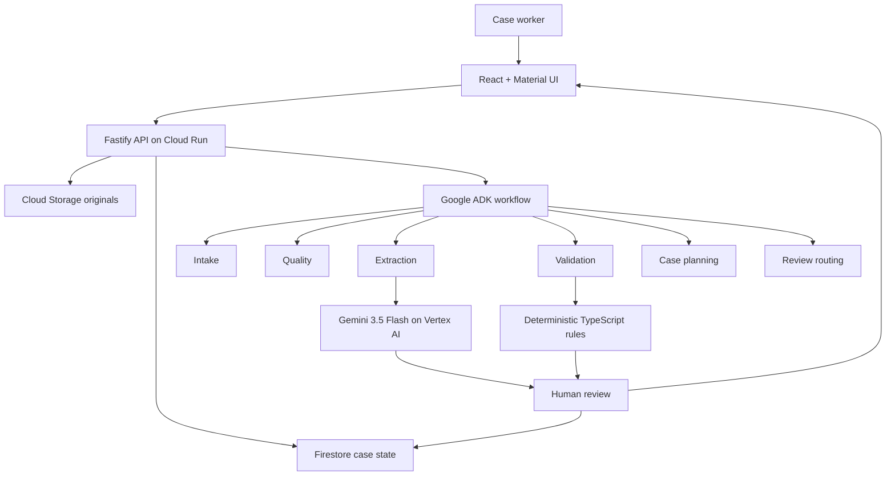

# ClaimFlow AI

> Evidence-first agentic AI for turning messy business documents into structured, validated, human-reviewable cases.

[](#project-status)
[](#hackathon-scope)
[](LICENSE)

**Live application:** https://claimflow-api-vb6ijwpumq-ts.a.run.app

## Overview

ClaimFlow AI is an agentic document-intelligence workflow for claims, restoration, field-service, and other document-heavy operations. It turns mixed-quality PDFs, photos, forms, notes, and email-style inputs into a structured case while preserving source evidence, uncertainty, deterministic business rules, and human control.

The system does more than transcribe text. It links extracted facts to source pages, detects missing or conflicting information, routes uncertainty to a reviewer, and records the workflow and human decisions in an audit trail.

ClaimFlow is a hackathon prototype for **case preparation**. It does **not** autonomously approve or deny insurance claims.

## Why this matters

Business teams often receive important information through fragmented and inconsistent documents:

- mobile photographs and scans;
- handwritten or partially readable forms;
- incomplete forms;
- long notes and email threads;
- invoices and reports with different values;
- duplicate or contradictory facts;
- missing dates, identifiers, addresses, or contact details.

A plain OCR pipeline can copy text, but staff still have to determine where a value came from, whether two sources disagree, and when a person must intervene. ClaimFlow focuses on that reconciliation layer.

## Verified MVP behavior

The deployed MVP can:

- create and persist a synthetic case;
- upload PDF/JPEG/PNG source documents;
- store originals in Cloud Storage and case state in Firestore;
- process a bounded multi-page packet with Gemini 3.5 Flash on Vertex AI;
- run a controlled six-stage Google ADK workflow;
- validate the model response with Zod;
- materialize typed fields with confidence and page-linked evidence;
- apply deterministic TypeScript business rules;
- detect missing fields, low confidence, invalid values, and contradictions;
- require human correction for conflicting source values;
- preserve review decisions and audit events;
- recover stale processing safely without silently re-billing the model;
- fail closed on invalid model output, timeouts, page-budget violations, and unreadable input;
- deploy automatically from `main` to Cloud Run through GitHub Actions using OIDC / Workload Identity Federation.

## Live conflict example

The official five-page synthetic motor-claim packet contains two deliberate conflicts:

- `incident.date`: `2026-09-10` versus `2026-09-11`;
- `damage.estimatedAmount`: `AUD 4,860.00` versus `AUD 4,142.00`.

In the verified production build, ClaimFlow preserves both values, shows **Conflict detected**, creates a `CONTRADICTION` issue, disables simple acceptance, and requires a reviewer to inspect the cited evidence and save one canonical value with a reason.

That behavior is intentional: the model is not allowed to silently decide which conflicting source is authoritative.

## Architecture



The important architectural boundary is that **agents interpret and plan, while schemas, deterministic rules, persistence, and consequential state transitions remain ordinary code**.

See:

- [System architecture](docs/architecture.md)
- [Agent architecture](docs/agent-architecture.md)
- [Human review policy](docs/human-review-policy.md)

## Six-stage workflow

```text
INTAKE → QUALITY → EXTRACTION → VALIDATION → CASE_PLANNER → REVIEW_ROUTER
```

Each persisted `AgentRun` can record status, timestamps, model/model version, prompt version, token usage, duration, input/output references, and a safe error summary.

## Safety model

ClaimFlow uses several independent controls:

- **Synthetic/redacted data only** for the prototype.
- **Structured output validation** with Zod.
- **Source evidence** attached to extracted fields.
- **Deterministic rules** for dates, required fields, contradictions, confidence, and state transitions.
- **Human review** for uncertainty and conflict.
- **No automatic claim decision.**
- **No automatic external contact.**
- **No silent conflict resolution.**
- **Fail-closed behavior** for invalid/truncated model output.
- **Single bounded model invocation** per processing attempt; no hidden retry loop.

## Technology

| Layer | Technology |
|---|---|
| Frontend | React, TypeScript, Vite, Material UI |
| API | Node.js, TypeScript, Fastify |
| Agent orchestration | Google Agent Development Kit (ADK) |
| Multimodal extraction | Gemini 3.5 Flash on Vertex AI |
| Runtime contracts | Zod |
| Deterministic validation | TypeScript rules |
| Case data | Firestore |
| Original documents | Cloud Storage |
| Runtime | Google Cloud Run |
| CI/CD | GitHub Actions + Google OIDC/WIF |
| Testing | Vitest + Firestore emulator + container smoke tests |

### Document AI decision

Google Document AI was evaluated as an optional specialist OCR/forms layer. It is **deferred for the hackathon MVP** because the live five-page synthetic benchmark was successfully processed by Gemini multimodal extraction with page-linked evidence and the deliberate conflicts preserved.

Document AI becomes worthwhile if later handwriting, blurry-scan, dense-table, or layout benchmarks demonstrate a measurable improvement that justifies the extra service complexity.

See [Phase 9 evaluation](docs/phase9-document-ai-evaluation.md).

## Project status

**Hackathon MVP verified in production.**

| Phase | Status |
|---|---|
| 0–5 — scope, foundations, domain, local flow, Google Cloud persistence | ✅ Complete |
| 6 — Gemini multimodal extraction | ✅ Live verified |
| 7 — ADK agent workflow | ✅ Live verified |
| 8 — deterministic rules and human review | ✅ Live verified and conflict-hardened |
| 9 — Document AI evaluation | ✅ Complete; deferred by evidence |
| 10 — CI/CD and secure deployment | ✅ Complete; keyless auto-deploy verified |
| 11 — observability and evaluation | ✅ Complete for hackathon MVP |
| 12 — demo and submission | 🟡 Recording/submission packaging in progress |

Latest verified production baseline before documentation closeout:

`d77d45a23233c7a33ebdf9f23ed15964003b1b46`

GitHub Actions run #56 passed formatting, linting, type checking, tests, build, container smoke, Firestore integration, OIDC authentication, Cloud Run deployment, and production endpoint verification.

See [Phase 11 evaluation closeout](docs/phase11-evaluation-closeout.md) and [Phase 12 submission runbook](docs/phase12-submission-runbook.md).

## Hackathon scope

ClaimFlow is built for **Forward: AI in Business** with the primary positioning:

**Improve an Existing Business Capability** — reduce manual document reconciliation while keeping source evidence and human control visible.

The demo is designed to be completed in approximately 2–3 minutes.

## Demo

The current official demo uses a five-page synthetic motor-claim packet. The strongest moment is not a clean extraction; it is the deliberate contradiction flow, where the system shows two source values and refuses to let the reviewer simply accept the combined AI answer.

See [Demo Scenario](docs/demo-scenario.md).

## Evaluation evidence

Automated tests cover:

- full six-stage workflow success;
- invalid JSON / invalid model output;
- foreign evidence references;
- forbidden extra output;
- `MAX_TOKENS` and safety-stopped completions;
- concurrent processing protection;
- timeout and provider abort;
- stale execution recovery;
- late-result rejection;
- PDF page-budget enforcement;
- unreadable document routing;
- invalid and future dates;
- cross-document contradiction handling;
- evidence-backed human correction;
- rejection never becoming `READY`.

The live production packet additionally demonstrated page-linked date and amount conflicts with the required human canonical correction flow.

## Local development

### Requirements

- Node.js 22.x or newer
- npm 11.9.0
- Git

```powershell
git clone https://github.com/amin076/claimflow-agent.git
Set-Location claimflow-agent
git switch main
npm ci
Copy-Item .env.example .env
npm run dev
```

Local development defaults to cloud-independent adapters:

```env
STORAGE_MODE=local
DATABASE_MODE=memory
AI_MODE=mock
```

Frontend: `http://localhost:5173`

Backend: `http://localhost:8080`

Health: `http://localhost:8080/health`

### Quality checks

```powershell
npm run format:check
npm run lint
npm run typecheck
npm test
npm run build
```

GitHub Actions repeats these checks and also runs the Firestore emulator integration test and packaged-container smoke test.

## Deployment

Merges to `main` trigger the production workflow after quality, Firestore, and container gates pass.

Deployment uses GitHub OIDC / Google Workload Identity Federation rather than downloadable service-account keys. The workflow builds from source, deploys `claimflow-api` in `australia-southeast1`, and verifies `/health`, `/ready`, and the web root.

See:

- [Cloud deployment guide](docs/cloud-deployment.md)
- [Phase 10 CI/CD closeout](docs/phase10-cicd-closeout.md)

## Repository map

```text
claimflow-agent/
├── apps/
│   ├── api/
│   └── web/
├── packages/
│   ├── config/
│   └── domain/
├── docs/
├── sample-data/
├── scripts/
├── .github/workflows/
└── README.md
```

## Team

- **Amin Nazari** — product direction, agent architecture, backend, Google Cloud, integration and evaluation
- **Behzad** — frontend/human-review experience and demo/pitch support

## Responsible-use boundary

ClaimFlow AI is a hackathon prototype, not an insurance decision engine. It must not autonomously approve or deny claims, determine legal liability, contact real customers, or process unredacted production data.

The project is not affiliated with, endorsed by, or connected to any insurer, restoration company, or claims-management provider unless explicitly stated.

## License

Licensed under the [Apache License 2.0](LICENSE).
