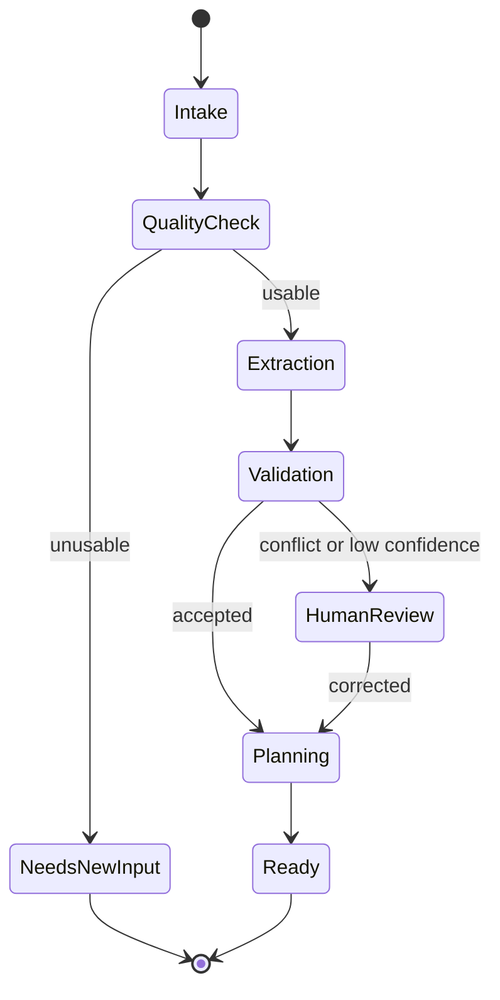

# Agent Architecture

## Design choice

ClaimFlow uses a controlled workflow with specialised reasoning stages. It does not use unrestricted peer-to-peer agents. The coordinator owns transitions, and every agent returns a typed result.

## Agent contracts

### Quality agent

Input: document reference and safe metadata.  
Output: quality flags, usable regions, confidence, and suggested remediation.

### Extraction agent

Input: document plus target schema.  
Output: candidate fields containing value, type, confidence, evidence reference, and uncertainty reason.

### Validation agent

Input: candidate fields across all documents.  
Output: agreements, conflicts, missing fields, rule findings, and review requirements.

### Case-planning agent

Input: validated case state and allowed action catalogue.  
Output: summary, priority suggestion, and ranked next actions with reasons.

### Communication agent (stretch)

Input: approved missing-information request.  
Output: draft email or voice script. It has no send capability in the MVP.

## Tool policy

Agents may read approved case artifacts and write typed proposals. They may not alter permissions, expose secrets, contact third parties, delete records, or make financial/legal decisions.

## Failure policy

- schema failure: reject and retry once with validation feedback;
- repeated model failure: stop and request human review;
- conflicting evidence: never select a winner silently;
- unavailable model: preserve the case and report a recoverable error;
- external integration failure: continue without the stretch feature.
