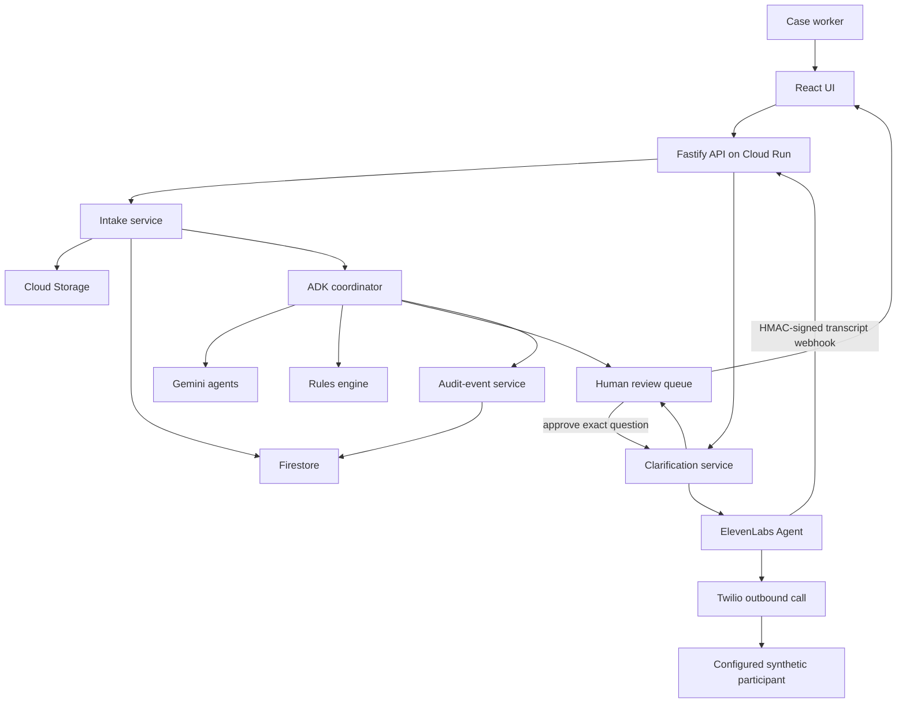

# System Architecture

## Context

The system separates user experience, deterministic application services, agent reasoning, storage, human review, and approval-gated external communication. Google ADK coordinates bounded tasks; it is not the database or business-rules engine. ElevenLabs voice clarification is layered on top of human review and never bypasses deterministic validation or the human correction boundary.

## Component responsibilities

| Component | Responsibility |
|---|---|
| React UI | Upload, evidence inspection, corrections, clarification approval, call initiation, summary |
| API | Authorization boundary, validation, case commands, webhook verification, signed file access |
| Intake service | File metadata, checksums, case creation, workflow start |
| ADK coordinator | Bounded sequence, tool calls, state handoff, stop conditions |
| Gemini agents | Multimodal quality assessment, extraction, reconciliation, planning, optional clarification wording |
| Rules engine | Required fields, formats, dates, amounts, identifiers, contradictions, state transitions |
| Firestore | Cases, fields, issues, clarifications, review decisions, audit events |
| Cloud Storage | Original and derived documents |
| Human review queue | Low confidence, conflicts, sensitive or consequential actions |
| Clarification service | Safe draft/fallback, approval state machine, atomic outbound-call reservation, transcript evidence |
| ElevenLabs + Twilio | Approval-gated voice conversation with the configured synthetic test participant |

## Deployment

For the MVP, the React build and API are served from one Cloud Run service to reduce deployment risk. Firestore and Cloud Storage remain managed services. ElevenLabs/Twilio are external providers used only after explicit reviewer approval. A separate worker or Pub/Sub pipeline is deferred unless synchronous processing becomes unreliable.

GitHub Actions deploys `main` using Google OIDC / Workload Identity Federation. Voice credentials and the fixed test destination are stored in Google Secret Manager and referenced by numbered secret versions on Cloud Run. The deployment workflow verifies that those references survive each release without reading secret payloads.

## Trust boundaries

1. Browser-to-API input is untrusted.
2. Uploaded content is untrusted and may contain prompt injection.
3. Model output is untrusted until schema and rule validation pass.
4. External communication is approval-gated and restricted to a server-configured test destination.
5. Post-call webhooks are untrusted until raw-body HMAC verification succeeds.
6. Voice transcripts are evidence, not verified facts; they cannot mutate a field automatically.
7. Storage access uses least-privilege service identities and Secret Manager references.

## Prompt-injection posture

Documents, clarification context, dynamic variables, and transcript content are treated as data, never as instructions. Text such as “ignore previous rules” inside an uploaded document or supplied context must not change tool permissions, workflow policy, recipients, approval requirements, or allowed actions.

The ElevenLabs agent receives the exact reviewer-approved clarification question plus bounded context. It has no ClaimFlow mutation tool and is instructed not to approve/deny claims or request unrelated information.

## Consequential-action boundary

The core rule is simple:

> Agents may interpret, draft and communicate; ordinary code plus explicit human actions own consequential state transitions.

For a contradiction, the state can move through voice clarification, but `COMPLETED` only means a transcript arrived. `RESOLVED` requires a valid human canonical correction followed by deterministic revalidation.
