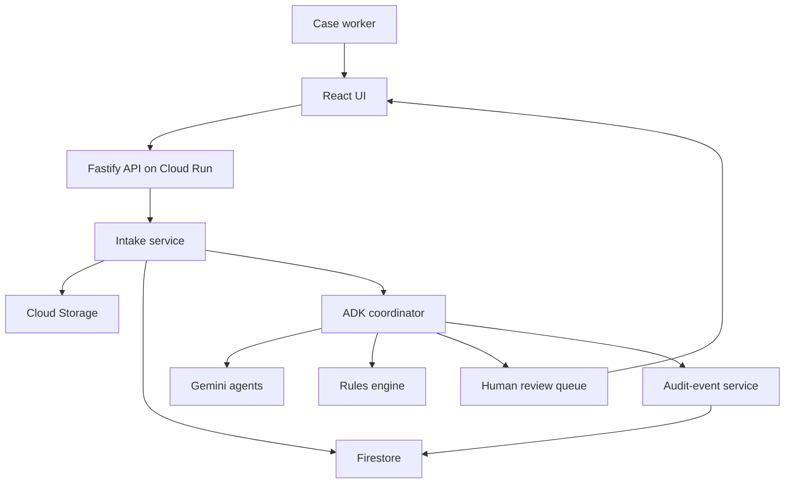

# System Architecture

## Context

The system separates user experience, deterministic application services, agent reasoning, storage, and human review. Google ADK coordinates bounded tasks; it is not the database or business-rules engine.

## Component responsibilities

| Component | Responsibility |
|---|---|
| React UI | Upload, evidence inspection, corrections, approval, summary |
| API | Authentication boundary, validation, case commands, signed file access |
| Intake service | File metadata, checksums, case creation, workflow start |
| ADK coordinator | Bounded sequence, tool calls, state handoff, stop conditions |
| Gemini agents | Multimodal quality assessment, extraction, reconciliation, planning |
| Rules engine | Required fields, formats, dates, amounts, identifiers, state transitions |
| Firestore | Cases, fields, issues, actions, review decisions, audit events |
| Cloud Storage | Original and derived documents |
| Human review queue | Low confidence, conflicts, sensitive or consequential actions |

## Planned deployment

For the MVP, the React build and API may be served from one Cloud Run service to reduce deployment risk. Firestore and Cloud Storage remain managed services. A separate worker or Pub/Sub pipeline is deferred unless synchronous processing becomes unreliable.

## Trust boundaries

1. Browser-to-API input is untrusted.
2. Uploaded content is untrusted and may contain prompt injection.
3. Model output is untrusted until schema and rule validation pass.
4. External communication is disabled or approval-gated.
5. Storage access must use least-privilege service identities.

## Prompt-injection posture

Documents are treated as data, never as instructions. Text such as “ignore previous rules” inside an uploaded document must not change tool permissions, workflow policy, recipients, or allowed actions.
