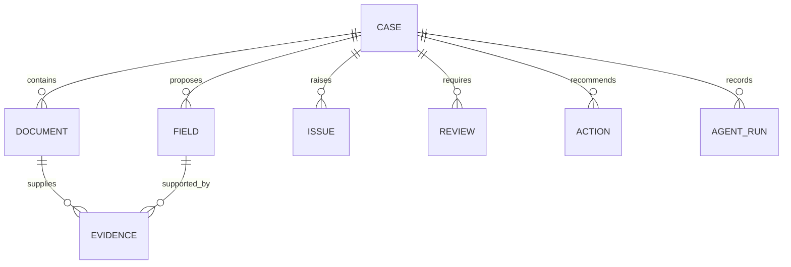

# Data Model

## Core entities



## Case states

`CREATED → PROCESSING → NEEDS_REVIEW | NEEDS_INPUT | READY | FAILED`

Only explicit commands may change case state. A model response alone cannot transition a case.

## Evidence-linked field

```json
{
  "fieldId": "incident-date",
  "name": "incidentDate",
  "value": "2026-09-08",
  "status": "proposed",
  "confidence": 0.72,
  "sourceDocumentId": "document-01",
  "evidence": {
    "page": 1,
    "region": "incident-date-box",
    "excerpt": "08/09/2026"
  },
  "uncertaintyReasons": ["handwriting"],
  "requiresReview": true
}
```

## Audit event

Each event records: event ID, case ID, timestamp, actor type, actor ID, action, input references, output references, outcome, and error summary. Prompts and raw documents should not be copied into logs unnecessarily.
