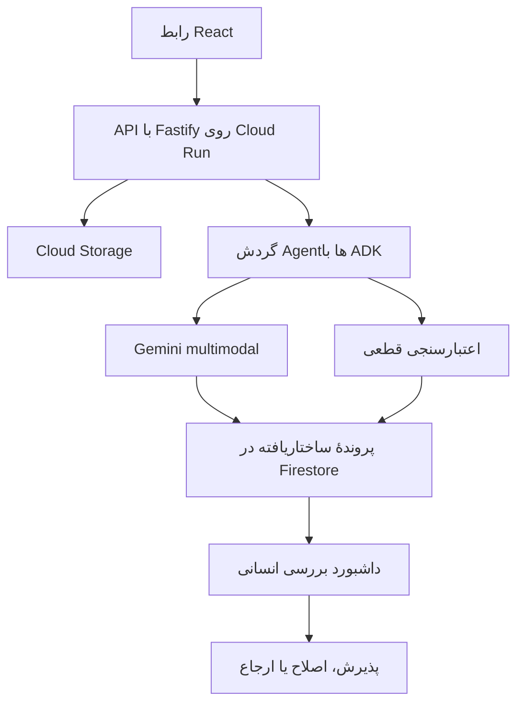

# ClaimFlow AI — نقشهٔ راه پیاده‌سازی

[English version](./roadmap.md)

این سند، ترتیب اجرایی ساخت پروژهٔ هکاتونی ClaimFlow AI را مشخص می‌کند و ارتباط میان گردش کار محصول، بخش‌های نرم‌افزار، سرویس‌های Google Cloud، معماری Agentها، آزمون، استقرار و ارسال نهایی را نشان می‌دهد.

## ۱. نتیجهٔ نهایی محصول

ClaimFlow AI ایمیل‌ها، فایل‌های PDF، عکس‌ها و فرم‌های دست‌نویس نامرتب را به پرونده‌های ساختاریافته و متصل به شواهد تبدیل می‌کند. سامانه کیفیت سند را بررسی می‌کند، اطلاعات را استخراج می‌کند، داده‌های ناقص یا متناقض را تشخیص می‌دهد و موارد نامطمئن را برای بررسی انسان می‌فرستد.

این سامانه برای آماده‌سازی پرونده به کارشناس کمک می‌کند و نباید به‌صورت مستقل یک خسارت بیمه را تأیید یا رد کند.

## ۲. گردش کار کامل



۱. کاربر یک پرونده می‌سازد و سند آزمایشی را بارگذاری می‌کند.  
۲. Backend فایل اصلی را ذخیره و رکورد پردازش را ایجاد می‌کند.  
۳. مرحلهٔ کنترل کیفیت، خوانا و قابل‌استفاده بودن سند را می‌سنجد.  
۴. Gemini فیلدهای ساختاریافته را همراه با confidence و evidence استخراج می‌کند.  
۵. Zod پاسخ مدل را اعتبارسنجی می‌کند.  
۶. قواعد قطعی TypeScript اطلاعات ناقص و متناقض را پیدا می‌کنند.  
۷. ADK مراحل پردازش و اقدام امن بعدی را هماهنگ می‌کند.  
۸. Firestore پرونده، خطاها، اجرای Agentها و رویدادهای audit را نگه می‌دارد.  
۹. بازبین انسانی نتیجهٔ نامطمئن را می‌پذیرد، اصلاح می‌کند یا ارجاع می‌دهد.

## ۳. محدودهٔ MVP

نسخهٔ نمایشی نخست باید بتواند:

- یک سند مصنوعی مربوط به خسارت خودرو را بارگذاری کند؛
- اطلاعات فرد، حادثه، خودرو و آسیب را استخراج کند؛
- confidence هر فیلد را نشان دهد؛
- هر مقدار مهم را به evidence موجود در سند متصل کند؛
- حداقل یک مقدار ناقص یا تناقض را تشخیص دهد؛
- خروجی نامطمئن را به بررسی انسانی بفرستد؛
- پرونده و تاریخچهٔ audit را ذخیره و نمایش دهد؛
- هم محلی و هم به‌صورت برنامهٔ مستقرشده روی Cloud Run اجرا شود.

مواردی که تا پایدار شدن هسته به تعویق می‌افتند:

- Authentication و مجوزدهی پیچیده؛
- پشتیبانی از چند نوع محصول بیمه؛
- پردازش asynchronous در مقیاس تولید؛
- دادهٔ واقعی مشتری؛
- تصمیم‌گیری خودکار دربارهٔ خسارت؛
- قابلیت صوتی ElevenLabs؛
- اتصال Document AI، مگر اینکه استخراج مستقیم Gemini کافی نباشد.

## ۴. ساختار مخزن

```text
claimflow-agent/
├── apps/
│   ├── web/                 # رابط React
│   └── api/                 # API مبتنی بر Fastify
├── packages/
│   ├── domain/              # Typeها و Zod schemaهای مشترک
│   ├── agents/              # Agentها، ابزارها و workflow مبتنی بر ADK
│   └── config/              # تنظیمات مشترک
├── infrastructure/          # تنظیمات Google Cloud و deployment
├── sample-data/             # اسناد مصنوعی و نتایج مورد انتظار
├── docs/
└── .github/workflows/
```

فناوری‌های اصلی:

- TypeScript، Node.js و npm workspaces؛
- React، Vite و Material UI؛
- Fastify و Zod؛
- Google ADK، Vertex AI و Gemini؛
- Cloud Run، Firestore، Cloud Storage، Artifact Registry و Secret Manager؛
- Vitest، ESLint، Prettier و GitHub Actions.

## ۵. فازهای پیاده‌سازی به‌ترتیب

### فاز صفر — تثبیت محدوده و ایمنی

- یک سناریوی نمایشی خسارت خودرو را نهایی کنیم.
- معیارهای موفقیت و فهرست قابلیت‌های قابل حذف را مشخص کنیم.
- فقط از داده‌های مصنوعی استفاده کنیم.
- مطمئن شویم هر تصمیم نامطمئن به انسان ارجاع داده می‌شود.
- هزینه‌ها را در محدودهٔ بودجهٔ Google Cloud نگه داریم.

**شرط خروج:** هر دو عضو تیم دربارهٔ یک workflow قابل‌آزمایش و موارد خارج از محدوده توافق دارند.

### فاز یک — Workspace و زیرساخت TypeScript

- npm workspaces را تنظیم کنیم.
- پوستهٔ برنامه‌های React و Fastify را بسازیم.
- تنظیمات مشترک TypeScript را اضافه کنیم.
- Formatting، lint، type checking و Vitest را تنظیم کنیم.
- اعتبارسنجی متغیرهای محیطی و فرمان‌های توسعهٔ محلی را بسازیم.
- workflow بررسی Pull Request را اضافه کنیم.

**شرط خروج:** فرمان‌های `npm install`، `npm run dev`، `npm test` و `npm run build` بدون دسترسی به Google Cloud اجرا می‌شوند.

### فاز دو — مدل دامنه و داده‌های مصنوعی

مدل‌های زیر را تعریف می‌کنیم:

- `ClaimCase`;
- `SourceDocument`;
- `ExtractedField`;
- `EvidenceReference`;
- `ValidationIssue`;
- `AgentRun`;
- `ReviewDecision`;
- `AuditEvent`.

نمونه‌های مصنوعی زیر را آماده می‌کنیم:

- فرم خوانا و کامل؛
- عکس کم‌کیفیت از فرم؛
- اطلاعات ضروری ناقص؛
- مقادیر متناقض میان دو سند؛
- خروجی نامعتبر مدل AI.

هر فیلد استخراج‌شده باید مقدار، confidence، محل evidence و وضعیت review داشته باشد.

**شرط خروج:** بدون AI بتوانیم پرونده‌های type-safe را بسازیم، اعتبارسنجی کنیم، آزمایش کنیم و نمایش دهیم.

### فاز سه — Vertical Slice محلی با Mock AI

API اولیه:

- `POST /api/cases`;
- `POST /api/cases/:id/documents`;
- `POST /api/cases/:id/process`;
- `GET /api/cases`;
- `GET /api/cases/:id`;
- `PATCH /api/cases/:id/review`;
- `GET /health`.

صفحه‌های اولیه:

- فهرست پرونده‌ها؛
- ساخت پرونده و upload؛
- وضعیت پردازش؛
- پروندهٔ استخراج‌شده؛
- صف review؛
- timeline مربوط به audit.

ابتدا از Mock extraction قطعی استفاده می‌کنیم تا data model، قرارداد API، رابط کاربری، مدیریت خطا و گردش review را پیش از اتصال AI واقعی اثبات کنیم.

**شرط خروج:** یک پروندهٔ مصنوعی تمام workflow محلی را طی می‌کند.

### فاز چهار — زیرساخت Google Cloud

از پروژهٔ `claimflow-ai-agents` استفاده می‌کنیم و فقط سرویس‌های لازم را فعال می‌کنیم:

- Cloud Run؛
- Artifact Registry؛
- Vertex AI؛
- Firestore؛
- Cloud Storage؛
- Secret Manager؛
- Cloud Logging؛
- APIهای لازم برای build و مدیریت منابع.

منابع اولیه:

- bucket خصوصی اسناد؛
- پایگاه Firestore؛
- repository در Artifact Registry؛
- Service Accountهای runtime و deployment؛
- نخستین سرویس Cloud Run.

IAM باید بر اصل least privilege باشد. هر توسعه‌دهنده از حساب Google خودش استفاده می‌کند و credential مشترک نخواهیم داشت.

**شرط خروج:** endpoint مربوط به health در Cloud Run مستقر شده است.

### فاز پنج — اتصال Cloud Storage و Firestore

Cloud Storage برای فایل‌های اصلی و artifactهای ساخته‌شده استفاده می‌شود. Firestore اطلاعات پرونده، فیلدها، مشکلات، وضعیت پردازش، reviewها و audit eventها را نگه می‌دارد.

حالت توسعهٔ مستقل از Cloud را حفظ می‌کنیم:

```env
STORAGE_MODE=local
DATABASE_MODE=memory
AI_MODE=mock
```

حالت Cloud:

```env
STORAGE_MODE=gcs
DATABASE_MODE=firestore
AI_MODE=vertex
GOOGLE_CLOUD_PROJECT=claimflow-ai-agents
```

کل محتوای فایل‌های بارگذاری‌شده را داخل Firestore ذخیره نمی‌کنیم.

**شرط خروج:** یک workflow واحد بتواند با adapterهای محلی یا Google Cloud اجرا شود.

### فاز شش — استخراج Multimodal با Gemini

- سند، دستور دقیق و ساختار JSON موردنیاز را به Gemini روی Vertex AI می‌فرستیم.
- مقدار، confidence، evidence، ابهام و فیلدهای ناقص را درخواست می‌کنیم.
- تمام پاسخ‌ها را با Zod اعتبارسنجی می‌کنیم.
- خروجی نامعتبر را رد می‌کنیم، دوباره امتحان می‌کنیم یا برای review می‌فرستیم.
- نام مدل و metadata پردازش را برای traceability نگه می‌داریم.
- خروجی مدل را هرگز دادهٔ قابل‌اعتماد فرض نمی‌کنیم.

**شرط خروج:** Gemini یک PDF یا تصویر مصنوعی را پردازش و خروجی معتبر و متصل به evidence تولید می‌کند.

### فاز هفت — گردش Agentها با ADK

مسئولیت‌های تخصصی را در یک workflow کنترل‌شده در Backend می‌سازیم:

| جزء | مسئولیت |
|---|---|
| Intake Agent | تشخیص نوع ورودی و ساخت context پردازش |
| Quality Agent | تشخیص سند ناخوانا، ناقص یا نامناسب |
| Extraction Agent | استخراج فیلدهای ساختاریافته همراه evidence |
| Validation Agent | ترکیب یافته‌های AI با قواعد قطعی |
| Case Planner | خلاصه‌سازی و انتخاب اقدام امن بعدی |
| Review Router | ارجاع ابهام، تناقض یا شکست به انسان |

در هکاتون، این اجزا داخل یک Backend deployment باقی می‌مانند و به microserviceهای جدا تبدیل نمی‌شوند.

ترتیب اجرا:

```text
Intake → Quality → Extraction → Validation → Case planning → Human review when required
```

**شرط خروج:** مراحل Agentها، خروجی‌ها، خطاها و تصمیم‌های routing در audit trail دیده می‌شوند.

### فاز هشت — قواعد قطعی و Human Review

قواعد TypeScript مانند این موارد را پیاده‌سازی می‌کنیم:

- تاریخ حادثه نمی‌تواند در آینده باشد؛
- فیلد ضروری نباید خالی باشد؛
- شمارهٔ registration میان اسناد باید یکسان باشد؛
- confidence پایین‌تر از threshold نیازمند review است؛
- سند ناخوانا باید جایگزین یا ارجاع داده شود؛
- اصلاح داده باید خروجی مشتق‌شدهٔ قدیمی را نامعتبر کند.

رابط review باید نشان دهد:

- مقدار استخراج‌شده؛
- confidence؛
- evidence اصلی؛
- هشدار اعتبارسنجی؛
- اقدام بعدی پیشنهادی؛
- کنترل‌های accept، edit و escalate.

**شرط خروج:** پروندهٔ متناقض به `NEEDS_REVIEW` می‌رسد و پس از اصلاح با تاریخچهٔ قابل‌ردیابی به `READY` تبدیل می‌شود.

### فاز نه — ارزیابی Document AI

Document AI برای MVP اختیاری است. ابتدا کیفیت استخراج مستقیم Gemini را آزمایش می‌کنیم.

فقط در صورت بهبود واقعی برای موارد زیر Document AI را اضافه می‌کنیم:

- PDF اسکن‌شده؛
- دست‌خط؛
- فرم‌های متراکم؛
- جدول‌ها؛
- OCR حساس به layout.

در صورت نیاز:

```text
Document → Document AI OCR → Gemini interpretation → Zod validation
```

**شرط خروج:** تصمیم استفاده، تعویق یا حذف Document AI همراه با شواهد ثبت شده باشد.

### فاز ده — CI/CD و استقرار امن

workflow مربوط به Pull Request:

۱. نصب dependencyها؛  
۲. بررسی formatting؛  
۳. lint؛  
۴. type-check؛  
۵. اجرای testها؛  
۶. build کردن Frontend و Backend.

workflow مربوط به deployment پس از merge به `main`:

۱. Authentication با GitHub OIDC و Workload Identity Federation؛  
۲. ساخت container؛  
۳. ارسال image به Artifact Registry؛  
۴. deployment روی Cloud Run؛  
۵. اجرای health check.

فایل کلید قابل‌دانلود برای Service Account ایجاد نمی‌کنیم. Secretها در Secret Manager قرار می‌گیرند.

**شرط خروج:** merge به `main` بدون ذخیرهٔ کلید Google Cloud، deployment تأییدشده ایجاد می‌کند.

### فاز یازده — Observability و ارزیابی

برای هر اجرا ثبت می‌کنیم:

- نام Agent یا مرحلهٔ workflow؛
- زمان آغاز و پایان؛
- مدل استفاده‌شده؛
- وضعیت موفقیت یا شکست؛
- مشکلات اعتبارسنجی؛
- نیاز یا عدم نیاز به review؛
- تصمیم نهایی بازبین.

سناریوهای ارزیابی:

| سناریو | نتیجهٔ مورد انتظار |
|---|---|
| فرم خوانا | confidence بالا و بدون review غیرضروری |
| عکس تار | هشدار کیفیت |
| تاریخ حادثهٔ ناقص | مشکل missing field |
| registration متناقض | contradiction و human review |
| پاسخ نامعتبر مدل | retry یا review امن، بدون خراب شدن پرونده |

**شرط خروج:** آزمون‌ها هم مسیر موفق و هم شکست امن را نشان دهند.

### فاز دوازده — دمو و ارسال نهایی

- Smoke test محیط production؛
- بررسی repository و README؛
- تهیهٔ screenshot واقعی محصول؛
- ضبط walkthrough کاربردی ۲ تا ۳ دقیقه‌ای؛
- تکمیل Project Story و technology tagهای Devpost؛
- افزودن لینک برنامه و repository؛
- تمرین pitch و پرسش‌های فنی؛
- نگهداری ویدئو و screenshot به‌عنوان نسخهٔ پشتیبان.

**شرط خروج:** برنامه، repository، ویدئو و Devpost کامل و با یکدیگر سازگار هستند.

## ۶. برنامهٔ پیشنهادی ۴۸ ساعته

| زمان | هدف |
|---|---|
| ساعت ۰ تا ۳ | Workspace، ابزارها و schemaهای مشترک |
| ساعت ۳ تا ۷ | پوستهٔ API و React |
| ساعت ۷ تا ۱۱ | workflow کامل محلی با Mock extraction |
| ساعت ۱۱ تا ۱۶ | Cloud Storage و Firestore |
| ساعت ۱۶ تا ۲۳ | استخراج Gemini همراه evidence |
| ساعت ۲۳ تا ۲۸ | هماهنگی ADK و اعتبارسنجی قطعی |
| ساعت ۲۸ تا ۳۳ | تجربهٔ Human Review |
| ساعت ۳۳ تا ۳۷ | Cloud Run و GitHub Actions |
| ساعت ۳۷ تا ۴۱ | سناریوهای ارزیابی و رفع مشکل |
| ساعت ۴۱ تا ۴۵ | بهبود UI و آماده‌سازی دمو |
| ساعت ۴۵ تا ۴۸ | ویدئو، Devpost، README و زمان اطمینان |

## ۷. ترتیب Commitها

۱. `chore: initialize TypeScript workspace`  
۲. `feat: add shared claim domain schemas`  
۳. `feat: add Fastify API shell`  
۴. `feat: add React application shell`  
۵. `test: add synthetic claim fixtures`  
۶. `feat: implement mock end-to-end claim flow`  
۷. `ci: add pull request quality checks`  
۸. `feat: add Google Cloud persistence adapters`  
۹. `feat: add Gemini evidence extraction`  
۱۰. `feat: orchestrate processing with ADK`  
۱۱. `feat: add human review workflow`  
۱۲. `ci: deploy verified main builds to Cloud Run`

## ۸. ترتیب حذف قابلیت‌ها در صورت کمبود زمان

به این ترتیب حذف می‌کنیم:

۱. ElevenLabs و ارتباط خروجی؛  
۲. مقایسه با Document AI؛  
۳. asynchronous queue؛  
۴. تکمیل Authentication؛  
۵. analytics پیشرفته؛  
۶. پشتیبانی از انواع بیشتر سند.

مواردی که نباید حذف شوند:

- دموی end-to-end؛
- نمایش evidence؛
- مدیریت contradiction و missing field؛
- Human Review؛
- رفتار امن هنگام شکست؛
- برنامهٔ deployشده؛
- بیان دقیق آنچه واقعاً پیاده‌سازی شده است.
