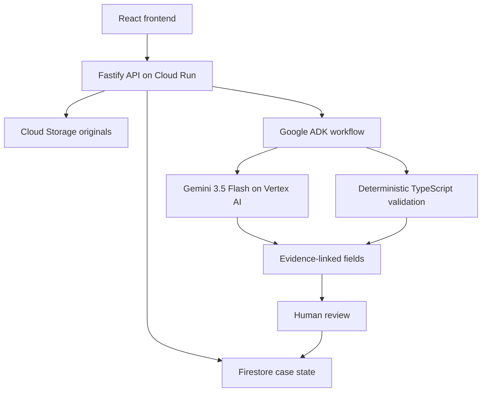

# ClaimFlow AI — Implementation Roadmap

[نسخهٔ فارسی](./roadmap.fa.md)

This roadmap records the implementation order and the **current verified state** of the ClaimFlow AI hackathon MVP.

## Product outcome

ClaimFlow AI turns messy business documents into structured, evidence-linked cases. It uses multimodal AI where interpretation is useful, deterministic code where rules must be reliable, and human review where evidence is uncertain or contradictory.

ClaimFlow assists case preparation. It does not autonomously approve or deny insurance claims.

## Current architecture



Controlled workflow:

```text
INTAKE → QUALITY → EXTRACTION → VALIDATION → CASE_PLANNER → REVIEW_ROUTER
```

## MVP acceptance criteria

The hackathon MVP must demonstrate that a reviewer can:

- create a synthetic case;
- upload a bounded PDF/image packet;
- extract claimant, incident, vehicle, and damage information;
- inspect confidence and page-linked source evidence;
- see missing information or contradictions;
- correct uncertain/conflicting values with a reason;
- inspect workflow and audit history;
- use the application through a stable Cloud Run deployment.

These criteria have been met in the verified production build.

## Phase status

| Phase | Scope | Current status |
|---|---|---|
| 0 | Scope and safety | ✅ Complete |
| 1 | TypeScript workspace and foundations | ✅ Complete |
| 2 | Domain model and synthetic fixtures | ✅ Complete |
| 3 | Local mock vertical slice | ✅ Complete |
| 4 | Google Cloud foundation | ✅ Live verified |
| 5 | Cloud Storage and Firestore | ✅ Live verified |
| 6 | Gemini multimodal extraction | ✅ Live verified |
| 7 | ADK agent workflow | ✅ Live verified |
| 8 | Deterministic rules and human review | ✅ Live verified and conflict-hardened |
| 9 | Document AI evaluation | ✅ Complete; deferred by evidence |
| 10 | CI/CD and secure deployment | ✅ Complete; keyless auto-deploy verified |
| 11 | Observability and evaluation | ✅ Complete for hackathon MVP |
| 12 | Demo and submission | 🟡 Application ready; final video/form submission remains |

## Phase 0 — Scope and safety

Completed boundaries:

- one motor-claim demo scenario;
- synthetic/redacted data only;
- no autonomous claim decision;
- explicit human-review routing;
- bounded model usage and document limits;
- cost-conscious Cloud Run configuration.

## Phase 1 — TypeScript workspace and foundations

Completed:

- npm workspaces;
- React/Vite frontend;
- Fastify API;
- shared TypeScript configuration;
- Vitest, ESLint, Prettier and type checking;
- pull-request CI.

## Phase 2 — Domain model and synthetic fixtures

Typed domain includes:

- `ClaimCase`;
- `SourceDocument`;
- `ExtractedField`;
- `EvidenceReference`;
- `ValidationIssue`;
- `AgentRun`;
- `ReviewDecision`;
- `AuditEvent`.

Synthetic scenarios cover clean data, missing data, contradictions, unreadable input and malformed AI output.

## Phase 3 — Local mock vertical slice

Completed local workflow:

- case creation and listing;
- file metadata/upload flow;
- deterministic mock processing;
- evidence-linked fields;
- validation issues;
- human review;
- audit timeline;
- local memory/storage adapters.

## Phase 4 — Google Cloud foundation

Completed and verified:

- Cloud Run;
- Artifact Registry / source build deployment;
- Firestore;
- Cloud Storage;
- Vertex AI;
- Cloud Logging;
- least-privilege runtime/deployment identities.

## Phase 5 — Cloud Storage and Firestore

Completed and verified:

- originals stored outside Firestore;
- case state persisted in Firestore;
- reviews and audit events persist;
- original-file download path works;
- Firestore emulator integration test runs in CI;
- local mode remains cloud-independent.

## Phase 6 — Gemini multimodal extraction

**Status: live verified.**

The production application processes the five-page synthetic packet with Gemini 3.5 Flash on Vertex AI and returns schema-valid, evidence-linked fields.

Important controls:

- one bounded Gemini request for uploaded sources;
- no hidden automatic retry loop;
- Zod validation of model output;
- evidence references validated against the case;
- model metadata and usage persisted;
- invalid or truncated output fails closed.

See [Phases 6–8](./phases-6-8.md).

## Phase 7 — ADK agent workflow

**Status: live verified.**

All six stages are visible in persisted `AgentRun` records and the UI:

1. Intake
2. Quality
3. Extraction
4. Validation
5. Case planning
6. Review routing

Failures are explicit and later stages can be skipped safely rather than pretending the workflow succeeded.

## Phase 8 — Deterministic rules and human review

**Status: live verified and conflict-hardened.**

Implemented rules include:

- incident date must be a real `YYYY-MM-DD` date and cannot be in the future;
- required fields cannot be missing;
- low confidence is visible;
- unreadable evidence routes to input/review;
- contradictions remain unresolved until supported human correction;
- source replacement invalidates stale derived output;
- rejection cannot produce `READY`.

Live production evidence confirmed deliberate same-packet conflicts:

- `incident.date`: `2026-09-10` vs `2026-09-11`;
- `damage.estimatedAmount`: `AUD 4,860.00` vs `AUD 4,142.00`.

The UI labels both as **Conflict detected**, creates `CONTRADICTION` issues, disables simple acceptance, and requires one canonical correction plus review reason.

## Phase 9 — Document AI evaluation

**Status: complete; Document AI deferred for the MVP.**

Gemini multimodal extraction successfully processed the live five-page benchmark, preserved page-linked evidence, and surfaced deliberate conflicts. Adding another OCR service immediately before the deadline would increase IAM, latency, cost and failure surface without evidence of a material improvement.

Document AI remains a future option for handwriting, blurry scans, dense tables and layout-heavy documents if a controlled benchmark shows measurable benefit.

See [Phase 9 evaluation](./phase9-document-ai-evaluation.md).

## Phase 10 — CI/CD and secure deployment

**Status: complete and live verified.**

Pull requests run:

1. dependency install;
2. formatting;
3. lint;
4. type checking;
5. tests;
6. build;
7. Firestore integration;
8. packaged-container smoke test.

Merges to `main` then:

1. authenticate to Google Cloud with GitHub OIDC / Workload Identity Federation;
2. build/deploy from source to Cloud Run;
3. configure the production runtime;
4. verify `/health`, `/ready` and the web root.

No downloadable Google service-account key is stored in GitHub.

Verified evidence: GitHub Actions run #56 deployed merge commit `d77d45a23233c7a33ebdf9f23ed15964003b1b46` successfully.

See [Phase 10 closeout](./phase10-cicd-closeout.md).

## Phase 11 — Observability and evaluation

**Status: complete for the hackathon MVP.**

Each `AgentRun` can record:

- stage;
- status;
- start/completion timestamps;
- model/model version;
- prompt version;
- token usage;
- duration;
- input/output references;
- safe error summary.

Cases additionally persist validation issues, review decisions and audit events.

Automated evaluation covers:

- full workflow success;
- malformed/invalid model output;
- truncated/safety-stopped output;
- concurrent processing protection;
- timeout and abort;
- stale run recovery;
- late-result rejection;
- page-budget enforcement;
- unreadable documents;
- invalid/future dates;
- contradictions;
- evidence-backed missing-field correction;
- rejection safety.

Live evidence adds successful production conflict detection and reviewer routing for the five-page packet.

See [Phase 11 evaluation closeout](./phase11-evaluation-closeout.md).

## Phase 12 — Demo and submission

**Status: application ready; final recording/submission packaging remains.**

Do not add large product scope now. The remaining work is operational:

- run one final fresh production case;
- capture clean screenshots;
- record the 2–3 minute walkthrough;
- paste the prepared submission description/tags;
- link the live application and repository;
- capture final submission confirmation.

See [Demo Scenario](./demo-scenario.md) and [Phase 12 submission runbook](./phase12-submission-runbook.md).

## Current production baseline

Live application:

`https://claimflow-api-vb6ijwpumq-ts.a.run.app`

Verified merge before documentation closeout:

`d77d45a23233c7a33ebdf9f23ed15964003b1b46`

## Cut order under deadline pressure

Keep deferred unless they fix a demonstrated blocker:

1. ElevenLabs/outbound communication;
2. Document AI integration;
3. distributed queues;
4. authentication polish;
5. advanced analytics;
6. additional insurance products/document types.

Never cut from the final demo:

- end-to-end processing;
- source evidence;
- contradiction handling;
- human review;
- safe failure behavior;
- auditability;
- deployed application;
- clear disclosure of limitations.
