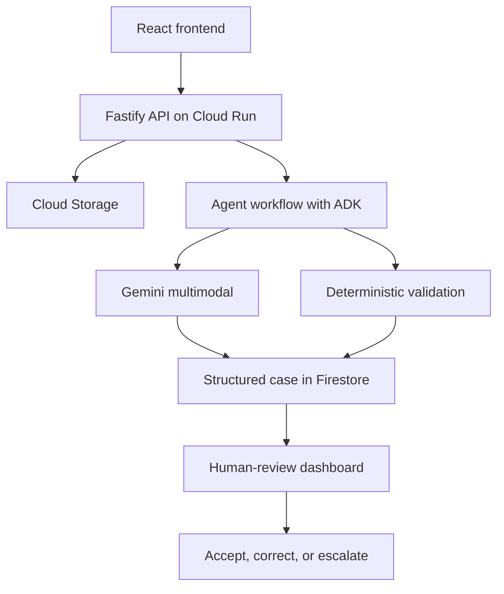

# ClaimFlow AI — Implementation Roadmap

[نسخهٔ فارسی](./roadmap.fa.md)

This document is the ordered implementation plan for the ClaimFlow AI hackathon project. It connects the product workflow, application layers, Google Cloud services, agent architecture, testing, deployment, and submission work.

## 1. Product outcome

ClaimFlow AI turns messy emails, PDFs, photographs, and handwritten forms into structured, evidence-linked cases. It checks quality, extracts facts, identifies missing or conflicting information, and routes uncertainty to a human reviewer.

The system assists case preparation. It must not autonomously approve or deny an insurance claim.

## 2. End-to-end workflow



1. A user creates a case and uploads a synthetic document.
2. The API stores the original file and creates a processing record.
3. The quality step checks whether the document is usable.
4. Gemini extracts structured fields with confidence and evidence.
5. Zod validates the model response.
6. TypeScript business rules detect missing or contradictory information.
7. ADK coordinates the processing steps and safe next action.
8. Firestore stores the case, issues, agent runs, and audit events.
9. A reviewer accepts, corrects, or escalates uncertain results.

## 3. MVP scope

The first demonstrable version must:

- upload one synthetic motor-claim document;
- extract claimant, incident, vehicle, and damage information;
- show confidence for each extracted field;
- link important values to their source evidence;
- detect at least one missing value or contradiction;
- route uncertain output to human review;
- save and display the case and its audit history;
- run locally and as a deployed Cloud Run application.

Deferred until the core flow is stable:

- authentication and complex authorization;
- support for multiple insurance products;
- production-scale asynchronous processing;
- real customer data;
- autonomous claim decisions;
- ElevenLabs voice features;
- Document AI integration unless Gemini-only extraction is insufficient.

## 4. Repository structure

```text
claimflow-agent/
├── apps/
│   ├── web/                 # React user interface
│   └── api/                 # Fastify HTTP API
├── packages/
│   ├── domain/              # Shared types and Zod schemas
│   ├── agents/              # ADK agents, tools, and workflow
│   └── config/              # Shared configuration
├── infrastructure/          # Google Cloud and deployment definitions
├── sample-data/             # Synthetic documents and expected results
├── docs/
└── .github/workflows/
```

Core technologies:

- TypeScript, Node.js, and npm workspaces;
- React, Vite, and Material UI;
- Fastify and Zod;
- Google ADK, Vertex AI, and Gemini;
- Cloud Run, Firestore, Cloud Storage, Artifact Registry, and Secret Manager;
- Vitest, ESLint, Prettier, and GitHub Actions.

## 5. Ordered implementation phases

### Phase 0 — Scope and safety

- Freeze one motor-claim demo scenario.
- Define the success criteria and cut list.
- Use synthetic data only.
- Confirm that every uncertain decision can reach human review.
- Keep deployment costs within the configured Google Cloud budget.

**Exit:** the team agrees on one testable workflow and what will not be built.

### Phase 1 — TypeScript workspace and foundations

- Configure npm workspaces.
- Create the React and Fastify application shells.
- Add shared TypeScript configuration.
- Configure formatting, linting, type checking, and Vitest.
- Add environment validation and local development commands.
- Create a pull-request CI workflow.

**Exit:** `npm install`, `npm run dev`, `npm test`, and `npm run build` work without Google Cloud access.

### Phase 2 — Domain model and synthetic fixtures

Define:

- `ClaimCase`;
- `SourceDocument`;
- `ExtractedField`;
- `EvidenceReference`;
- `ValidationIssue`;
- `AgentRun`;
- `ReviewDecision`;
- `AuditEvent`.

Prepare synthetic cases for:

- a clear, complete form;
- a low-quality photographed form;
- missing required information;
- contradictory values across documents;
- malformed AI output.

Every extracted field should be able to hold a value, confidence, evidence location, and review status.

**Exit:** typed cases can be created, validated, tested, and rendered without AI.

### Phase 3 — Local mock vertical slice

**Status: complete.** The local in-memory API and responsive React workspace now
cover case creation, synthetic document metadata, deterministic processing,
evidence-linked fields, validation issues, human review, case listing, and the
audit timeline. The workflow remains intentionally independent of Google Cloud.

Implement the initial API:

- `POST /api/cases`;
- `POST /api/cases/:id/documents`;
- `POST /api/cases/:id/process`;
- `GET /api/cases`;
- `GET /api/cases/:id`;
- `PATCH /api/cases/:id/review`;
- `GET /health`.

Build the initial screens:

- case list;
- new case and upload;
- processing progress;
- extracted case;
- review queue;
- audit timeline.

Use deterministic mock extraction first. This proves the data model, API contract, interface, errors, and review flow before cloud AI is introduced.

**Exit:** one synthetic case completes the full local workflow.

### Phase 4 — Google Cloud foundation

**Status: live exit gate passed.** Amin verified private deployment and revision `claimflow-api-00002-klk` serving 100% traffic. See [deployment guide](./cloud-deployment.md).

Use Google Cloud project `claimflow-ai-agents` and enable only the required services:

- Cloud Run;
- Artifact Registry;
- Vertex AI (defer activation to Phase 6);
- Firestore;
- Cloud Storage;
- Secret Manager;
- Cloud Logging;
- required build and resource-management APIs.

Create:

- a private document bucket;
- a Firestore database;
- an Artifact Registry repository;
- runtime and deployment service accounts;
- the first Cloud Run service.

Use least-privilege IAM. Developers use their own Google identities; credentials are never shared.

**Exit:** the API health endpoint is deployed to Cloud Run.

### Phase 5 — Cloud Storage and Firestore

**Status: live exit gate passed.** The original case, document, review and audit were recovered after the revision change. Firestore transactions, private original-file storage, same-origin UI and CI verification are implemented.

Use Cloud Storage for original uploads and generated file artifacts. Use Firestore for case metadata, fields, issues, processing state, reviews, and audit events.

Keep a cloud-independent developer mode:

```env
STORAGE_MODE=local
DATABASE_MODE=memory
AI_MODE=mock
```

Cloud mode uses:

```env
STORAGE_MODE=gcs
DATABASE_MODE=firestore
AI_MODE=mock
GOOGLE_CLOUD_PROJECT=claimflow-ai-agents
```

Do not store entire uploaded documents inside Firestore.

**Exit:** the same workflow can use local adapters or Google Cloud adapters.

### Phase 6 — Gemini multimodal extraction

**Status: implemented and covered by automated tests; live Gemini/UI acceptance pending.** See [Phases 6–8](./phases-6-8.md).

- Send the document, focused instructions, and required JSON structure to Gemini on Vertex AI.
- Request extracted values, confidence, source evidence, ambiguity notes, and missing fields.
- Validate every response with Zod.
- Reject, retry, or route invalid output to review.
- Persist the model name and processing metadata for traceability.
- Never treat generated output as trusted input.

**Exit:** Gemini processes one synthetic PDF or image and produces schema-valid, evidence-linked fields.

### Phase 7 — ADK agent workflow

**Status: implemented and covered by automated tests; live Gemini/UI acceptance pending.** See [Phases 6–8](./phases-6-8.md).

Implement specialized responsibilities inside one controlled backend workflow:

| Component | Responsibility |
|---|---|
| Intake Agent | Classify the input and establish processing context |
| Quality Agent | Detect unreadable, incomplete, or unsuitable documents |
| Extraction Agent | Extract structured fields with evidence |
| Validation Agent | Combine AI findings with deterministic checks |
| Case Planner | Summarize findings and select a safe next action |
| Review Router | Send uncertainty, conflicts, and failures to a human |

For the hackathon, these components remain inside one backend deployment rather than separate microservices.

Ordered execution:

```text
Intake → Quality → Extraction → Validation → Case planning → Human review when required
```

**Exit:** agent steps, outputs, failures, and routing decisions are visible in the audit trail.

### Phase 8 — Deterministic rules and human review

**Status: implemented and covered by automated tests; live Gemini/UI acceptance pending.** See [Phases 6–8](./phases-6-8.md).

Implement TypeScript rules such as:

- incident date cannot be in the future;
- required fields cannot be empty;
- registration values across documents should agree;
- confidence below the configured threshold requires review;
- unreadable evidence requires replacement or escalation;
- corrected input invalidates stale derived output.

The review interface must show:

- extracted value;
- confidence;
- original evidence;
- validation warning;
- suggested next action;
- accept, edit, and escalate controls.

**Exit:** a conflicting case reaches `NEEDS_REVIEW`, and a corrected case reaches `READY` with traceable history.

### Phase 9 — Document AI evaluation

Document AI is optional for the MVP. Start with Gemini multimodal extraction, then test whether OCR quality is sufficient.

Add Document AI only if it materially improves:

- scanned PDFs;
- handwriting;
- dense forms;
- tables;
- layout-aware OCR.

If needed, use:

```text
Document → Document AI OCR → Gemini interpretation → Zod validation
```

**Exit:** a documented decision records whether Document AI was included, deferred, or rejected based on evidence.

### Phase 10 — CI/CD and secure deployment

Pull-request workflow:

1. install dependencies;
2. check formatting;
3. lint;
4. type-check;
5. run tests;
6. build frontend and backend.

Deployment workflow after merge to `main`:

1. authenticate using GitHub OIDC and Workload Identity Federation;
2. build the application container;
3. push it to Artifact Registry;
4. deploy it to Cloud Run;
5. run a health check.

Do not create downloadable service-account keys. Application secrets belong in Secret Manager.

**Exit:** a merge to `main` produces a verified Cloud Run deployment without stored Google Cloud keys.

### Phase 11 — Observability and evaluation

Record for every run:

- agent or workflow step;
- start and completion time;
- model used;
- success or failure status;
- validation issues;
- human-review requirement;
- final reviewer decision.

Evaluate at least these scenarios:

| Scenario | Expected outcome |
|---|---|
| Clear form | High confidence and no unnecessary review |
| Blurry photograph | Quality warning |
| Missing incident date | Missing-field issue |
| Conflicting registration | Contradiction and human review |
| Invalid model response | Safe retry or review; no corrupted case |

**Exit:** tests and demonstration evidence show both success paths and safe failure paths.

### Phase 12 — Demo and submission

- Run production smoke tests.
- Verify the repository and README.
- Capture genuine product screenshots.
- Record a 2–3 minute functional walkthrough.
- Complete the Devpost story and technology tags.
- Link the live application and repository.
- Rehearse the pitch and technical questions.
- Preserve a recording and screenshots as a fallback.

**Exit:** the application, repository, video, and Devpost entry are complete and consistent.

## 6. Recommended 48-hour schedule

| Time | Goal |
|---|---|
| Hours 0–3 | Workspace, tooling, and shared schemas |
| Hours 3–7 | API and React shells |
| Hours 7–11 | Complete local flow with mock extraction |
| Hours 11–16 | Cloud Storage and Firestore |
| Hours 16–23 | Gemini extraction with evidence |
| Hours 23–28 | ADK orchestration and deterministic validation |
| Hours 28–33 | Human-review experience |
| Hours 33–37 | Cloud Run and GitHub Actions |
| Hours 37–41 | Evaluation cases and reliability fixes |
| Hours 41–45 | UI polish and demo preparation |
| Hours 45–48 | Video, Devpost, README, and submission buffer |

## 7. Commit order

1. `chore: initialize TypeScript workspace`
2. `feat: add shared claim domain schemas`
3. `feat: add Fastify API shell`
4. `feat: add React application shell`
5. `test: add synthetic claim fixtures`
6. `feat: implement mock end-to-end claim flow`
7. `ci: add pull request quality checks`
8. `feat: add Google Cloud persistence adapters`
9. `feat: add Gemini evidence extraction`
10. `feat: orchestrate processing with ADK`
11. `feat: add human review workflow`
12. `ci: deploy verified main builds to Cloud Run`

## 8. Cut order under time pressure

Cut in this order:

1. ElevenLabs and outbound communication;
2. Document AI comparison;
3. asynchronous queues;
4. authentication polish;
5. advanced analytics;
6. support for additional document types.

Never cut:

- the end-to-end demo;
- evidence display;
- contradiction and missing-field handling;
- human review;
- safe failure behavior;
- a deployed application;
- clear disclosure of what is actually implemented.
